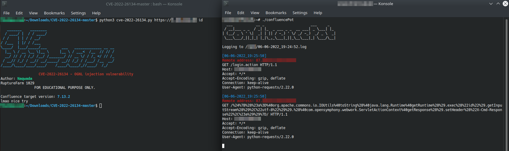

# confluencePot

ConfluencePot is a simple honeypot for the Atlassian Confluence unauthenticated and remote OGNL injection vulnerability ([CVE-2022-26134](https://nvd.nist.gov/vuln/detail/CVE-2022-26134)).



## About the vulnerability

You can find the official advisory by Atlassian to this vulerability [here](https://confluence.atlassian.com/doc/confluence-security-advisory-2022-06-02-1130377146.html). For details about the inner workings and exploits in the wild you should refer to the reports by [Rapid7](https://www.rapid7.com/blog/post/2022/06/02/active-exploitation-of-confluence-cve-2022-26134/) and [Cloudflare](https://blog.cloudflare.com/cloudflare-observations-of-confluence-zero-day-cve-2022-26134/).
Affected but not yet patched systems should be deemed **compromised** until further investigation.

## About the tool

ConfluencePot is written in Golang and implements its own HTTPS server to minimize the overall attack surface. To make it appear like a legit Confluence instance it returns a bare-bones version of a Confluence landing page. Log output is written to stdout and a log file on disk. ConfluencePot **DOES NOT** allow attackers to execute commands/code on your machine, it only logs requests and returns a bogus response. To run ConfluencePot you either need to create a self-signed TLS certificate with *openssl* or request one from e.g. *Let's Encrypt*.

### Building & Running it

You need a recent version of Golang to run/build confluencePot and the appropriate privileges to bind to port 443. We recommend to execute it in a tmux session for easier handling.

```
go build confluencePot.go
./confluencePot
```

## Testing and Issues

ConfluencePot was tested using the public exploit by [Nwqda](https://github.com/Nwqda/CVE-2022-26134), which seems to be the most used variant in the wild at the time of writing.
If you find anything wrong with confluencePot please feel free to open an issue or send us a pull request.

Follow us on Twitter --> [@SI_FalconTeam](https://twitter.com/SI_FalconTeam) <-- to stay up to date with our latest research. Stay safe!
